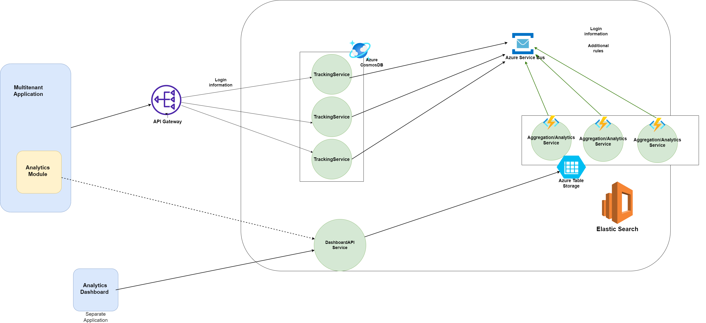

# Multi-Tenant Analytics Platform

[](LICENSE)

Multi-Tenant Analytics Platform is a robust, in-house analytics solution designed for multi-tenant web applications. Inspired by tools like Google Analytics—but built entirely on your own cloud infrastructure—this platform enables secure, tenant-specific tracking and visualization of user activity without relying on third-party services.

---

## Table of Contents

- [Overview](#overview)
- [Features](#features)
- [Architecture](#architecture)
  - [Tracking Service](#tracking-service)
  - [Aggregation Service](#aggregation-service)
  - [Dashboard Service](#dashboard-service)
- [Technology Stack](#technology-stack)
- [Getting Started](#getting-started)
- [Future Enhancements](#future-enhancements)
- [Contributing](#contributing)
- [License](#license)

---

## Overview

The platform tracks key user activities—such as page views, time spent per page, and login events—in a secure, scalable, and multi-tenant environment. Tenant administrators can access analytics specific to their own domain, while internal teams can view aggregated data across all tenants. This design ensures privacy, performance, and flexibility as your application scales.

---

## Features

- **User Activity Tracking:** Collect detailed events like page views, user logins, and session durations.
- **Real-Time Aggregation:** Process user events in near real-time via an event-driven architecture.
- **Multi-Tenant Isolation:** Ensure that each tenant sees only their own data with secure access controls.
- **Rich Data Visualization:** View key performance charts including:
  - **Page Performance:** Number of views per page and average time spent.
  - **User Activity:** Daily logins (with first-time login counts) and login distribution by country.
- **Extensible & Adaptable:** Easily add new charts and metrics as requirements evolve.
- **Secure & Scalable:** Leverage cloud services like Azure Cosmos DB, Service Bus, and Table Storage for robust performance and high availability.

---

## Architecture

### Tracking Service

The **Tracking Service** is a backend microservice responsible for capturing user interactions across your application.

- **Purpose:** Record activities such as page views and logins.
- **Data Store:** Persists raw event data in **Azure Cosmos DB** for high-throughput, low-latency writes.
- **Event Emission:** Publishes events to **Azure Service Bus** to trigger downstream processing.
- **Security:** Secured using **JWT Authentication** to ensure only authorized entities can track and send data.

**Key Packages:**
- Microsoft.Azure.Cosmos
- Azure.Messaging.ServiceBus
- Microsoft.AspNetCore.Authentication.JwtBearer
- Azure.Identity, Azure.Security.KeyVault.Secrets
- Newtonsoft.Json

**Endpoint Example:**
- `POST /api/tracking/track` – Captures a user activity event.

---

### Aggregation Service

The **Aggregation Service** is an Azure Function that processes and aggregates user activity events received from the **Service Bus**.

- **Event Processing:** Listens to the `user-activity-events` queue in **Azure Service Bus**.
- **Data Aggregation:** Computes metrics like daily page views, average time on page, and login counts by country.
- **Data Storage:** Saves aggregated data into **Azure Table Storage** for fast, cost-effective querying.
- **Security & Configuration:** Uses **Azure Key Vault** and Managed Identity to securely access connection strings and other secrets.

**Function Trigger Example (C#):**
```csharp
[FunctionName("ProcessUserActivityEvent")]
public static async Task RunAggregationJob(
    [ServiceBusTrigger("user-activity-events", Connection = "ServiceBusConnectionString")] ServiceBusReceivedMessage message,
    ILogger log)
{
    log.LogInformation($"Aggregation job triggered at: {DateTime.UtcNow}");
    await aggregationService.ProcessUserActivityEventAsync(message, log);
}
```

---

### Dashboard Service

The **Dashboard Service** is responsible for retrieving aggregated data from **Azure Table Storage** and presenting it through an interactive UI. This service is adaptable:
- **Integrated View:** Can be embedded within your existing web application.
- **Standalone Application:** Alternatively, it can run as a separate app offering a dedicated analytics interface.

The dashboard displays:
- **Page Performance Tab:** Number of page views and average time per page.
- **User Activity Tab:** Total logins per day (including first-time logins) and login counts per country.

---

## Technology Stack

- **Backend:** ASP.NET Core, C#
- **Cloud Services:**
  - **Azure Cosmos DB:** High-volume, low-latency storage for raw tracking data.
  - **Azure Service Bus:** Decoupled, event-driven communication.
  - **Azure Functions:** Serverless compute for data aggregation.
  - **Azure Table Storage:** Cost-effective storage for aggregated metrics.
  - **Azure Key Vault:** Secure management of secrets and connection strings.
- **Security:** JWT Authentication for secure API access.
- **Libraries & SDKs:** Microsoft.Azure.Cosmos, Azure.Messaging.ServiceBus, and others.

---

## Getting Started

### Prerequisites

- An active Azure subscription.
- Access to Azure services (Cosmos DB, Service Bus, Table Storage, Key Vault).
- .NET 9 (or later) SDK installed.

### Local Setup

1. **Clone the Repository:**
   ```bash
   git clone https://github.com/TuralSuleymani/activity-analytics-microservices-app.git
   cd multi-tenant-analytics
   ```

2. **Configure Environment Variables:**
   - Set up your connection strings and secrets (preferably using Azure Key Vault).
   - Update the `appsettings.json` files for both the Tracking Service and Aggregation Service with the necessary configuration.

3. **Run the Tracking Service:**
   ```bash
   dotnet run
   ```

4. **Deploy and Test the Aggregation Service:**
   - Deploy the Azure Function using the Azure Functions Core Tools or through the Azure Portal.
   - Verify that the function is correctly triggered by sending test events to the Service Bus queue.

5. **Launch the Dashboard Service:**
   - Serve the Dashboard Service locally or deploy it as needed.
   - Connect it to the Azure Table Storage to visualize the aggregated data.

For more detailed instructions, please refer to the individual service documentation within this repository.

---

## Future Enhancements

- **Expanded Metrics:** Add additional charts and metrics as requirements evolve.
- **Cross-Tenant Analytics:** Develop an internal dashboard for aggregated views across all tenants.
- **Enhanced Security:** Integrate further security measures and auditing capabilities.
- **Performance Optimizations:** Continue to refine scalability and performance, leveraging advanced Azure features.

---

## Contributing

Contributions are welcome! Please fork the repository and submit pull requests with detailed explanations for any changes. For major changes, open an issue first to discuss what you would like to change.
---

## License

This project is licensed under the [MIT License](LICENSE).

---

*Empower your multi-tenant applications with deep, actionable insights—securely and at scale!*
